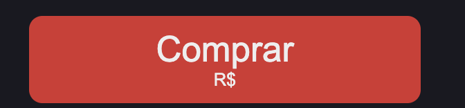
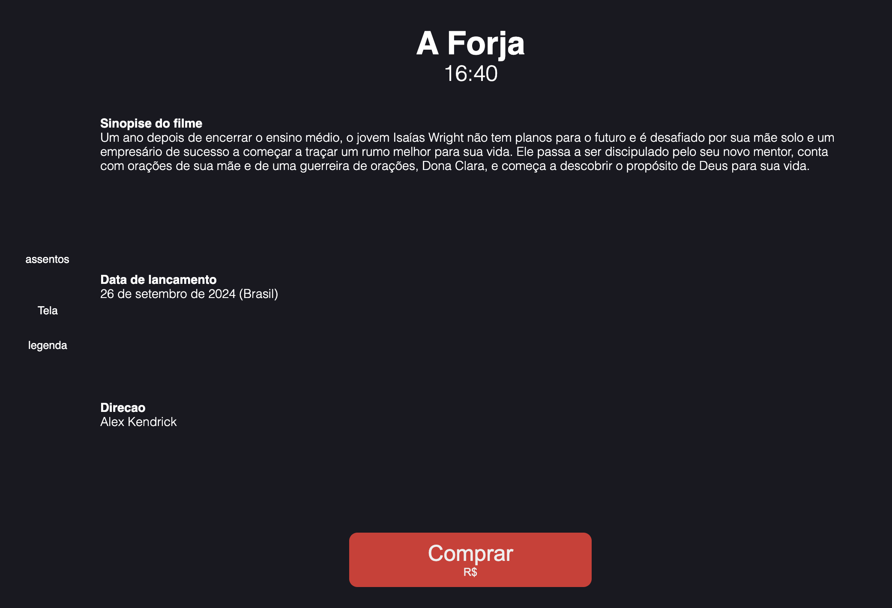

# POC-Cinema (React em Prática)


 <!--ts-->
 
 * [Overview do projeto](#Overview)
 * [Ajustes Iniciais NextJS](#Ajustes_Iniciais)
 * [Criando Componentes - BuyButton](#BuyButton)
 * [Criando Componentes - Movie](#Componente_Movie)
   * [Layout Básico](#BuyButton)
   * [Inserindo informações através de um json (require)](#Estilos)
   * [Inserindo a tela e a leganda (UseState)](#BuyButton)
 * [Criando Componentes - Seats](#BuyButton)
   * [Layout Básico](#Estilos)
   * [Inserindo assentos](#Estilos)
 * [Deixando a Página Responsiva](#Estilos)
   * [Diferentes tamanhos de tela (media queries)](#Estilos)
   * [Diferentes esquemas de cores (matchMedia)](#Estilos)
  
 *   
 
 <!--te-->
#Overview


## Ajustes_Iniciais
 
A estrutura básica de um projeto Next.js geralmente se parece com isso:
~~~arduino
   my-next-app/
   ├── app/
   │   ├── page.js
   │   ├── layout.js
   │   ├── globals.css
   │   └── ... (outras pastas e arquivos)
   ├── public/
   │   ├── images/
   │   └── favicon.ico
   ├── styles/
   │   └── globals.css
   ├── package.json
   ├── next.config.js
   └── README.md
~~~
### Limpando o Page JS e o global CSS/<br>
O Nex.JS vem com um layout default quando o iniciamos, algo parecido com a imagem abaixo (a depender da versão):
[imagem]

Entretanto, nosso layout será bem diferente, então podemos deletar tudo que está dentro da cláusula "Return" no arquivo "page.js",e vamos aplicar a cláusula "use client" no inicio do script:

```javascript
"use client"

export default function Home() {
  return ( 

  );
}

```

Também vamos deletar todo o código dentro do arquivo "global.css" para que aplicar a nossa estilização em fases posteriores do projeto

[imagem] 


## BuyButton

Vamos criar o nosso primeiro componente, o botão de compra de ingressos. 
Para isso, o primeiro passo é criar <b>duas pastas dentro do diretório "src/app"</b>,  uma chamada "components" e outra chamada "BuyButton", resultando no caminho "src/app/components/BuyButton". 
Depois, criamos os arquivos "index.js" e "buybutton.module.css" 

Ao abrir o arquivo "index.js" inputamos a seguinte estrutura inicial:

```javascript
"use client" //definicão entre cliente e servidor js
import styles from './buybutton.module.css' // importa o aquivo css

const BuyButton = () => { 

    return (

    )
} //arrown function de retorno - vai retornar a estrutura html

export default BuyButton //exporta este componente para que possa ser utilizado em outros componentes

```
Observação: Esta estrutura básica com a importaçao do css, Arrow Function de retorno e expot do objeto será usada para a criação de todos os demais componentes deste projeto.

Em seguida, criamos a estrutura html que o componente deve retornar para gerar o botão, com as devidas classes para estilização no css:

```javascript
"use client"
import styles from './buybutton.module.css'

const BuyButton = ({preco}) => { // a arrow function recebe a variável preço -  que seá calculada em outro componente

    return (
    <section className={styles.button}> //section inicial
        <button className={styles.buybutton}> // criação do botão
            <div>
                Comprar<br/> //texto dentro do botão
            </div>
            <div className={styles.preco}>
                R${preco} // preço total da compra - que será calculado em outro componente
            </div>
        </button>
    </section>
    )
}

export default BuyButton
```
Desta forma, já temos um botão, podemos importar este componente na página principal (arquivo "page.js") 

```javascript
"use client"
import BuyButton from "./components/BuyButton"; // importação do componente "Buy Buttons"

export default function Home() {

  return ( 
    <div>
      <BuyButton /> //tag gerada com o export do componente - desta forma, todo o código que fizemos no arquivo "index.js" é transposto para este arquivo.
    </div>
  );
}

```

Agora, já temos um botão em nossa página

[imagem]

Com isso, podemos formatá-lo através do arquivo "buybutton.module.css" conforme abaixo:

```css
.button {
    display: flex;
    justify-content: center;
}

.buybutton {
    background-color: #CD4A3E;
    color: #F0F0F0;
    padding: 12px;
    margin-top: 24px;
    font-size: 32px;
    border-radius: 12px;
    width: 354px ;
    border: none;
    cursor: pointer;
    
}

.preco {
    font-size: 16px;
    margin-top: 8
    4px;
    font-weight: 200;
}

```

Assim, temos como resultafo final:




## Componente_Movie

Agora, necessitamos um componente para importar as inforomações do json e criar o "corpo" da aplicação

Criamos uma basta chamada "Movie" dentro do diretório "components", em seguida criamos os arquivos "index.js" e "movie.module.css".

Assim como no componente anterior, importamos o css e criamos a estrutura padrão no arquivo "index.js"

Na construção do index.js demosntrada abaixo, temos os seguintes passos:

 1. Criamos uma constante chamada "Movie" que recebe as informaçoes referentes ao filme como título, horário, sinópise, lancamento e direcao (informações contidas no arquivo json)
 2. Retornamos o html com as devidas seções, separadas em topo da página e base da página.  
 3. A base da página foi separada entre "sala" para representar a sala de cinema, e "texto", onde estarão as informacoes sobre o filme (nosso foco nesse bolo)
 4. Os parágrafos "assentos", "tela" e "legenda" serão substituídos posteriormente, apenas represnetam o posicionamento destes elementos
 5. Utilizamos as tags "styles" para a formatação com o css
 6. Utilizamos as demais tags para obter as informações que necessitamos do arquivo json direto da oágina principal

```javascript

"use client"
import styles from './movie.module.css'

const Movie = ({ titulo, horario, sinopise, lancamento, direcao }) => {

    return (
        <section className={styles.movie}>
            <div className={styles.top}>
                <h1 className={styles.titulo}><b>{titulo}</b><br /></h1>
                <h2 className={styles.horario}>{horario}</h2>
            </div>
            <section className={styles.bottom}>
                <div className={styles.room}>
                    <div className={styles.seat}>
                        <p>assentos</p>
                    </div>
                    <div className={styles.tela}>
                        <p>Tela</p>
                        <p>Legenda</p>
                    </div>
                </div>
                <div className={styles.texto}>
                    <p className={styles.sin}><b>Sinopise do filme</b><br /> {sinopise} </p>
                    <p className={styles.data}><b>Data de lancamento</b><br /> {lancamento} </p>
                    <p className={styles.dir}><b>Direcao</b><br /> {direcao} </p>
                </div>
            </section>
        </section>

    )
}

export default Movie

```

Para obtermos as informações sobre o filme, fizemos as seguintes alterações no arquivo "page.js":

 1. Importamos o componente "movies" no inicio da página
 2. Criamos uma constante chamda "movies" que recebe as informações do arquivo json através da função "require"
 3. Dento da função "Home()", inserimos a nova tag html "<Movie />" e associamos cada valor esperado com o json

```javascript

"use client"
import BuyButton from "./components/BuyButton";
import Movie from "./components/Movie";

const movies = require("./components/filme.json");

export default function Home() {

  return ( 
    <div>
      <section>
        <Movie titulo={movies.titulo} horario={movies.horario} sinopise={movies.sinopse} lancamento={movies.dataLancamento} direcao={movies.direcao} />
      </section>
      <BuyButton />
    </div>
  );
}

```
Exemplificando: para extrair a sinópise do filme, utilizamos o argumento "movies.sinopise", a variável "movies" contem em vetor todas as infomações do arquivo json, quando utilizamos o ".sinopise" conseguimos acessar a informação dentro do arquivo (como se fosse um ínfice).

Repare que o arquivo possui o formato "chave":"valor" de todas as informações que necessitamos:

```java

{
  "titulo": "A Forja",
  "sinopse": "Um ano depois de encerrar o ensino médio, o jovem Isaías Wright não tem planos para o futuro e é desafiado por sua mãe solo e um empresário de sucesso a começar a traçar um rumo melhor para sua vida. Ele passa a ser discipulado pelo seu novo mentor, conta com orações de sua mãe e de uma guerreira de orações, Dona Clara, e começa a descobrir o propósito de Deus para sua vida.",
  "dataLancamento": "26 de setembro de 2024 (Brasil)",
  "direcao": "Alex Kendrick",
  "horario": "16:40",
}

```

Por fim, formatamos com o seginte CSS:

```CSS

.movie {
    font-family: sans-serif;
    color: white;
    display: flex;
    flex-direction: column;
}

.top {
    display: flex;
    align-items: center;
    flex-direction: column;
    justify-content: center;
    font-size: 40px;
    font-weight: 700;
    text-align: center;
}

.horario {
    font-size: 32px;
    font-weight: 200;
    margin-top: -48px;
}

.bottom {
    display: flex;
    flex-direction: row;
    align-items: center;
    justify-content: space-around;
}

.room {
    display: block;
    flex-direction: column;
    align-items: center;
    justify-content: space-around;
    padding: 24px;

}

.seat {
    display: flex;
    flex-direction: row;
    justify-content: center;
    align-items: center;
    flex-wrap: wrap;
    width: 45%;
    margin: 0 27%;
}

.tela{
    display: flex;
    flex-direction: column;
    padding: 24px;
    align-items: center;
}


.texto {
    display: flex;
    flex-direction: column;
    justify-content: flex-start;
    font-size: 18px;
    font-weight: lighter;
    align-items: baseline;
    margin-right: 10%;
    
}

.sin {
    padding-bottom: 10%;
}

.data {
    padding-bottom: 10%;
}

.dir {
    padding-bottom: 10%;
}

```

Assim, temos o seguinte resultado:




